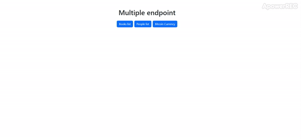

# Multiple Endpoints :dart:

At this project we're using three differents API's in order to consume them in the very same page. 

I use the async and await style in order to get the sitanxe more tidy. 

